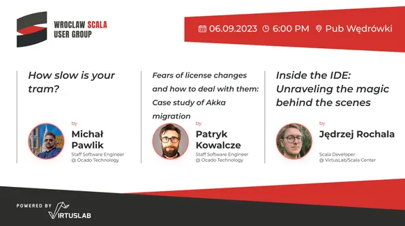
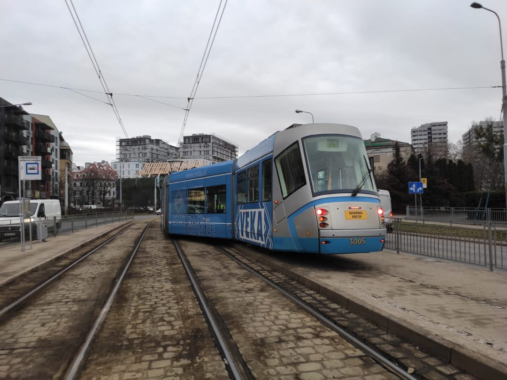
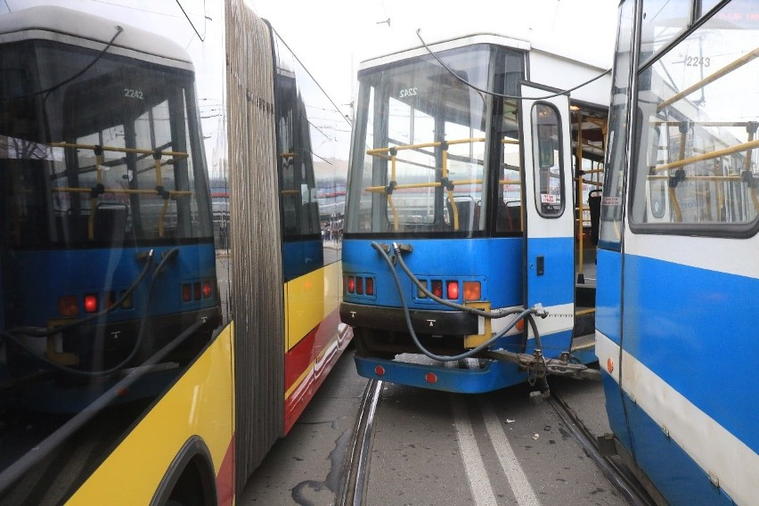
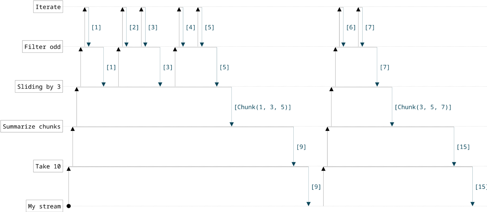
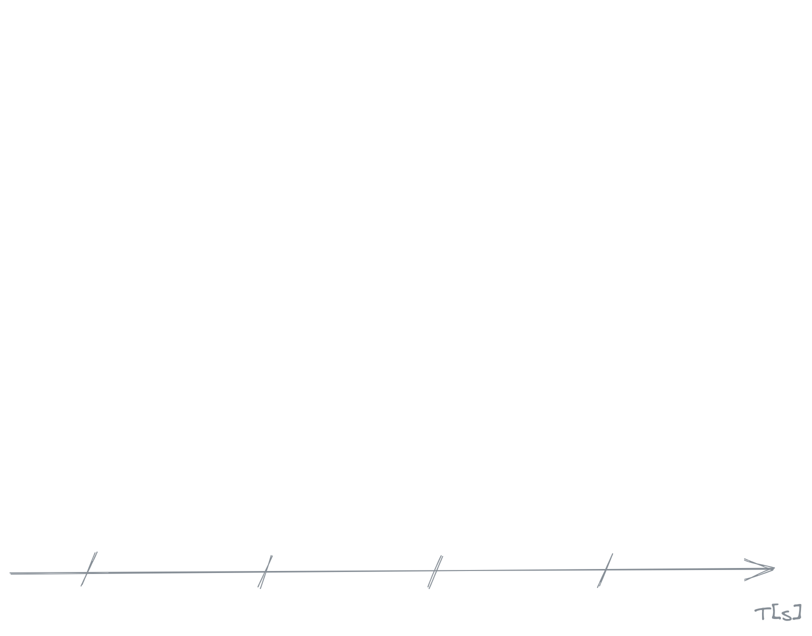
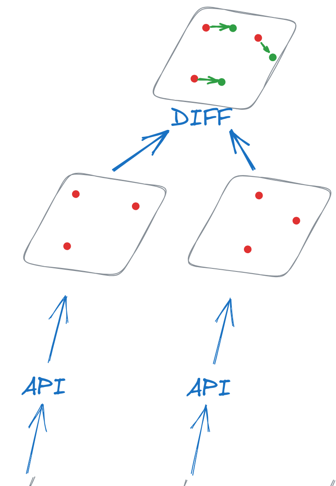

<!-- _footer: Photo by [Guillaume.G](https://commons.wikimedia.org/wiki/File:Tram_Wroclaw,_Moderus_Beta_MF_24_AC_n%C2%B02916_(cropped).jpg#mw-jump-to-license) CC BY-SA 4.0 -->
<!-- _class: intro -->

# How slow is your tram? :tram:

###### using STTP, CE3, FS2 and scala-cli


---

##### Great stories feature 
# Great villains

---

# Star Wars


---

# Batman


---

# And...

---

<!-- _class: divider -->

# My story


--- 

<!-- _class: sxm-logo -->

# My name is Michał :wave:

- Senior Software engineer @ SiriusXM
- Blog about Scala
- OSS from time to time

--- 

# My name is Michał :wave:

## I have bad luck with public transportation

--- 

# My name is Michał :wave:

## I have bad luck with public transportation

And this is my fs2 story with trams


---

# Like when I was giving this talk in Wrocław



---

## They hid the entrance to the venue


---

# Or the other day


---

<!-- _footer: Foto: [Mateusz Iwanczyk Photo](https://www.facebook.com/MateuszIwanczykPhotography) -->

# They took a bus stop too literally




---

<!-- _footer: Foto: [Jarosław Jakubczak](https://gazetawroclawska.pl/awaria-torowiska-i-wykolejenie-tramwaju-w-rejonie-wielkiej-wyspy-i-placu-grunwaldzkiego/ga/c1-14649973/zd/40659813) -->

## This happens to me



---

<!-- _footer: Foto: [wroclawskakomunikacja.pl](https://wroclawskakomunikacja.pl/raporty-przeglad/66-wykolejenia-i-zdarzenia/408-wykolejenie-na-ul-teatralnej-zdjecia) -->

## from time


---

<!-- _footer: Foto: [Paweł Relikowski / Polska Press](https://gazetawroclawska.pl/wykolejenie-przy-renomie-we-wroclawiu-tramwaj-wyjechal-z-torow-i-uszkodzil-sygnalizacje/ga/c1-17818881/zd/69774307) -->

## to time


---

Thus I asked myself

---

<!-- _class: divider yellow-background -->

# How slow is your tram?

---

# Let's try to find out

---

# Plan

1) Find data source of vehicle positions
2) Fetch and parse
3) Fetch some more
4) Calculate diffs
5) Produce statistics

---
<!-- _class: divider -->

# Find data source of vehicle positions

---

# Interactive map

https://mpk.wroc.pl/strefa-pasazera/zaplanuj-podroz/mapa-pozycji-pojazdow

---


<!-- ---

 -->

---


---

# Inspect 🕵️


---

# Investigate 🕵️

```bash
curl -s 'https://mpk.wroc.pl/bus_position' \
  -H 'accept: application/json, text/javascript, */*; q=0.01' \
  -H 'content-type: application/x-www-form-urlencoded; charset=UTF-8' \
  --data-raw 'busList%5Bbus%5D%5B%5D=110&busList%5Btram%5D%5B%5D=31&busList%5Btram%5D%5B%5D=33' \
  --compressed | jq       

[
  {
    "name": "31",
    "type": "tram",
    "y": 17.051546,
    "x": 51.076923,
    "k": 22471783
  },
  {
    "name": "31",
    "type": "tram",
    "y": 17.049835,
    "x": 51.081802,
    "k": 22472415
  },
 /* ... */
]  
```

---

# Finally data!


```json
[
  {
    "name": "31",
    "type": "tram",
    "y": 17.051546,
    "x": 51.076923,
    "k": 22471783
  },
 /* ... */
]    
```

---

<!-- _transition: none -->

# What does it mean? 🤔

* `name` - line name like `31`, `33`, `110`
* `type` - one of `tram`, `bus`
* `y` - latitude
* `x` - longitude
* `k` - 🤨


---

# What does it mean? 🤔

- `name` - line name like `31`, `33`, `110`
- `type` - one of `tram`, `bus`
- `y` - latitude
- `x` - longitude
- `k` - 🤨 looks like a vehicle id

---

<!-- _class: divider -->

# Plan

1. Find data source of vehicle positions ✅
2. Fetch and parse
3. Fetch some more
4. Calculate diffs
5. Produce statistics

---


<!-- _class: divider yellow-background -->


# Coding time 💻

---

# Fetch and parse

Shape of our request
* HTTP POST
* List of vehicles like `busList[bus][]=110&busList[tram][]=31&busList[tram][]=33`
* `content-type: application/x-www-form-urlencoded`
* Expect JSON output

---

<!-- _class: line-numbers -->

# STTP Client

```scala
val apiUri = uri"https://mpk.wroc.pl/bus_position"

def payload(buses: List[String], trams: List[String]) =
  (trams.map(v => s"busList[tram][]=$v") ++
    buses.map(v => s"busList[bus][]=$v")).mkString("&")

// ☝️ builds this thing: busList[bus][]=110&busList[tram][]=31&busList[tram][]=33
```

---


# STTP

Data model

<!-- _class: line-numbers -->
```scala
case class Record(
  name: String,
  x: Double,
  y: Double,
  k: Int // 🤨
) derives Codec.AsObject // This will generate JSON Encoder and Decoder 
```

---

# STTP

<!-- _class: line-numbers -->

```scala
def request(
    backend: SttpBackend[IO, Any], buses: List[String], trams: List[String]
  ): IO[List[Record]] = // Note the return type
  basicRequest
    .post(apiUri)
    .body(payload(buses, trams)) // Something like busList[bus][]=110&busList[tram][]=31&busList[tram][]=33
    .contentType(MediaType.ApplicationXWwwFormUrlencoded)
    .response(asJson[List[Record]])
    .send(backend)
    .map(_.body)                 // We are only interested in the result
    .rethrow                     // Fail `IO` on all errors, we are being simple here
```

---

# Let's run it

* Our `request` returns an `IO`, so we need a way to execute it
* It requires `SttpBackend` so we need to create one

---

# Let's run it

The easiest way to execute an `IO` is to create a `Main` class that handles it for us

```scala
object Main extends IOApp.Simple {
  def run: IO[Unit] = ??? // our logic goes here 
}
```

---

# Let's run it

<!-- _class: line-numbers -->

Let's create a backend, execute the request and print the result

```scala
object Main extends IOApp.Simple {
  val buses = List("110")
  val trams = List("31", "33")

  def run = 
    HttpClientFs2Backend
      .resource[IO]()
      .use(backend => request(backend, buses, trams))
      .flatMap(IO.println)
}
```

---

# Let's run it

<!-- _class: line-numbers -->

```scala
object Main extends IOApp.Simple {
  val buses = List("110")
  val trams = List("31", "33")

  def run = 
    HttpClientFs2Backend
      .resource[IO]()
      .use(backend => request(backend, buses, trams))
      .flatMap(IO.println)
}
```

Execution result

```bash
$ scala-cli sttp-client.scala

List(
  Record(31,51.141502,16.95872,22475890), Record(31,51.110912,17.02159,22475017), Record(31,51.07934,17.050734,22475050),
  Record(31,51.12252,17.011976,22475871), Record(31,51.097458,17.03275,22475942), Record(110,51.096992,17.037682,22312466),
  Record(33,51.112633,16.99349,22476133), Record(33,51.107376,17.035055,22476039), Record(33,51.11388,17.1032,22476064),
  Record(33,51.10771,17.040272,22476110)
)
```

---

<!-- _transition: none -->
# Nice, we've got the data!

---

# Nice, we've got the data!

but that `k: Int // 🤨`


---

# `k: Int // 🤨`

Let's hide the API call behind an interface

```scala
trait Vehicles[F[_]] {
  def list(): F[Seq[Vehicle]]
}
```

* Notice the `Vehicle` type - it needs better fields than `x`, `y`, `k`

---

<!-- _class: line-numbers -->

# `Vehicle` model

```scala
case class Vehicle(
  lineName: Vehicle.LineName,
  measuredAt: Instant,
  position: Position,
  id: Vehicle.Id // no more `k` 🎉
)
```

###### It could be called `VehiclePosition` or `VehicleMeasurement` but let's stick with `Vehicle` for clarity

---

<!-- _class: line-numbers -->

# `Vehicle` model

```scala
case class Vehicle(
  lineName: Vehicle.LineName,
  measuredAt: Instant,
  position: Position,
  id: Vehicle.Id
)

case class Position(latitude: Double, longitude: Double)

object Vehicle {
  case class Id(value: String) extends AnyVal
  case class LineName(value: String) extends AnyVal
}
```

---


# Refactoring time! 🚧

<!-- _class: line-numbers -->

Our existing code

```scala
val apiUri = uri"https://mpk.wroc.pl/bus_position"

def payload(buses: List[String], trams: List[String]) = 
  (trams.map(v => s"busList[tram][]=$v") ++ buses.map(v => s"busList[bus][]=$v")).mkString("&")

case class Record(
  name: String,
  x: Double,
  y: Double,
  k: Int
) derives Codec.AsObject // This will generate JSON Encoder and Decoder  

def request(backend: SttpBackend[IO, Any], buses: List[String], trams: List[String]): IO[List[Record]] =
  basicRequest
    .post(apiUri)
    .body(payload(buses, trams)) // Something like busList[bus][]=110&busList[tram][]=31&busList[tram][]=33
    .contentType(MediaType.ApplicationXWwwFormUrlencoded)
    .response(asJson[List[Record]])
    .send(backend)
    .map(_.body)                 // We are only interested in the result
    .rethrow                     // Fail `IO` on all errors, we are being simple here
```

---

# Refactoring time! 🚧

<!-- _class: line-numbers -->
<!-- _transition: none -->

How hard can it be?

```scala
trait Vehicles[F[_]] {
  def list(): F[Seq[Vehicle]]
  // 👆 each time we call this, we receive latest data from API
}

object Vehicles {

  def mpkWrocInstance(
      backend: SttpBackend[IO, Any],
      buses: List[String],
      trams: List[String]
  ): Vehicles[IO] = ??? // make your guess
}
```
---

# Refactoring time! 🚧

<!-- _class: line-numbers -->

Just wrap the `request` method

```scala
trait Vehicles[F[_]] {
  def list(): F[Seq[Vehicle]]
  // 👆 each time we call this, we receive latest data from API
}

object Vehicles {

  def mpkWrocInstance(
      backend: SttpBackend[IO, Any],
      buses: List[String],
      trams: List[String]
  ): Vehicles[IO] = { () =>
    (request(backend, buses, trams), IO.realTimeInstant).mapN {
      (responses, now) =>
        responses.map { record =>
          Vehicle(
            lineName = Vehicle.LineName(record.name),
            measuredAt = now,
            position = Position(record.x, record.y),
            id = Vehicle.Id(record.k.toString)
          )
        }
    }
  }
}
```

---


---

# `Vehicles` service done ✅

```scala
trait Vehicles[F[_]] {
  def list(): F[Seq[Vehicle]]
}
```

Now we have an abstract way to fetch meaningful data
```scala
case class Vehicle(
  lineName: Vehicle.LineName,
  measuredAt: Instant,
  position: Position,
  id: Vehicle.Id
)
```

---

# One last thing

In the next step we'll be looking into the distance covered between two measurements

---

# Distance 

```scala
case class Vehicle(
  lineName: Vehicle.LineName,
  measuredAt: Instant,
  position: Position,
  id: Vehicle.Id
){
  // calculate distance in meters
  def distance(other: Vehicle): Double = ???
}
```

---

# Distance 

```scala
case class Vehicle(
  lineName: Vehicle.LineName,
  measuredAt: Instant,
  position: Position,
  id: Vehicle.Id
){
  // It's a shameless copy-paste from StackOverflow 😅
  def distance(other: Vehicle): Double = {
    val earthRadius = 6371000 // Earth's radius in meters
    val lat1 = toRadians(position.latitude)
    val lon1 = toRadians(position.longitude)
    val lat2 = toRadians(other.position.latitude)
    val lon2 = toRadians(other.position.longitude)

    val dlon = lon2 - lon1
    val dlat = lat2 - lat1

    val a = pow(sin(dlat / 2), 2) + cos(lat1) * cos(lat2) * pow(sin(dlon / 2), 2)
    val c = 2 * atan2(sqrt(a), sqrt(1 - a))

    val distance = earthRadius * c

    distance
  }
}
```

---

# Distance

The point is, we can now calculate distance covered by vehicle

```scala
val measurement1: Vehicle = ???
val measurement2: Vehicle = ???

measurement1.distance(measurement2) // like this
```

###### It calculates [Geographical Distance](https://en.wikipedia.org/wiki/Euclidean_distance) but [Euclidean Distance](https://en.wikipedia.org/wiki/Euclidean_distance) would be good enough

---

# Back to the plan!

---

<!-- _class: divider -->

# Plan

1. Find data source of vehicle positions ✅
2. Fetch and parse ✅
3. Fetch some more 🛠️
4. Calculate diffs 🛠️
5. Produce statistics

---

# Streams 


---

# Who knows what a stream is? 🤚

---

# Functional stream

Think of a sequence of data elements that
* Computes values on demand; is lazy
* Can be infinite or finite
* Can be asynchronous - supports non-blocking operations
* Has a powerful API - offers rich combinators

<!-- 
- fs2 streams are sequences of data elements, representing anything that can be processed as a stream.

- fs2 streams are lazy, computing values only as they are needed.

- While not all streams are infinite, fs2 streams can represent infinite sequences, depending on the source of data.

- fs2 supports asynchronous operations, allowing for non-blocking I/O operations.

- fs2 offers a rich set of combinators for transforming and manipulating streams, enabling expressive and efficient stream processing.

 -->

---

# FS2: Functional Streams for Scala

Short intro

---

# Let's have an exercise 🏃

* Create an infinite stream of natural numbers `1, 2, 3, 4, 5, ...`
* Keep only the odd ones `1, 3, 5, 7, ...`
* Slide through by 3 elements `(1, 3, 5), (3, 5, 7), (5, 7, 9), ...`
* Add each group `9, 15, 21, ...`
* Take first `10`
<!-- 

---

## How would it look like without streams?

Think of it for a second

---

I asked an LLM for a mutable, old fashioned solution 🤖

```scala
var currentNumber =  1
var sumOfGroup =  0
var count =  0
val sumsList = List.newBuilder[Int] // Use a ListBuilder for efficient list construction

while (count <  10) {
  sumOfGroup += currentNumber
  if (currentNumber %  3 ==  0) { // Check if it's the third number in the group
    sumsList += sumOfGroup
    count +=  1
    sumOfGroup =  0 // Reset sum for the next group
  }
  currentNumber +=  2 // Increment by  2 to keep only odd numbers
}

// Convert the ListBuilder to a List and print the sums
val sums = sumsList.result()
sums.foreach(println)
```
 -->


---

# FS2: Functional Streams for Scala

Here's how you do this

---

# FS2: Functional Streams for Scala

<!-- _class: line-numbers -->


```scala
Stream
  .iterate(1)(_ + 1)  // Create an infinite stream of natural numbers
  .filter(_ % 2 != 0) // Filter for odd numbers: 1, 3, 5, 7, 9, ...
  .sliding(3)         // Slides over each 3 elements: (1, 3, 5), (3, 5, 7), (5, 7, 9), ...
  .map { chunk =>
    chunk(0) + chunk(1) + chunk(2) // Add them together: 9, 15, 21, ...
  }
  .take(10)           // Fetch the first ten results
```

---

# But how does it work 🤔

---

# See it with Aquascape



Brought to you with https://zainab-ali.github.io/aquascape

---

# To the real use case!

---

# What should our app do

* Upon each `N` seconds call the API for new data
* Compare current result with previous one
  - Find how vehicle moved, calculate diff
* After a fixed amount of updates, show some statistics

---

# Let's visualize it!

---

<!-- _transition: none -->



---

<!-- _transition: none -->


---

<!-- _transition: none -->


---

<!-- _transition: none -->


---

<!-- _transition: none -->


---


---

# How to implement it

We want to build a stream that:

* Is infinite
* Acts on given time interval like every `N` seconds
* Lists vehicles using `Vehicles[IO].list()`
* Joins results by vehicle `id`
* Calculate the distance using `Vehicle.distance` and the elapsed time
* Build a map of `(Vehicle.LineName, Vehicle.Id) -> (Distance, AVG Speed)`


---

# Step by step

Infinite stream that lists vehicles every `N` seconds

---

<!-- _class: line-numbers -->

# Step by step

Infinite stream that lists vehicles every `N` seconds

```scala
val interval = 7.seconds

def stats(vehicles: Vehicles[IO]): IO[Map[(LineName, Id), VehicleStats]] = 
  fs2.Stream
    .fixedRateStartImmediately[IO](interval)
    .evalMap(_ => vehicles.list())
    // TBC
```

Easy right?

---

# Step by step

- Is infinite ✅
- Acts on given time interval like every `N` seconds ✅
- When the time comes - it lists vehicles using `Vehicles[IO].list()` ✅
- Joins previous and current result by vehicle `id`
- Calculate the distance using `Vehicle.distance` and the elapsed time
- Build a map of `(Vehicle.LineName, Vehicle.Id) -> VehicleStats`

---

<style scoped>
/* Center the image */
p {
  text-align: center;
}
</style>

# Step by step


Slide over data, take current and previous measurement and calculate the diff

---

# Step by step

Slide over data, take current and previous measurement and calculate the diff

<!-- _class: line-numbers -->

```scala
def stats(vehicles: Vehicles[IO]): IO[Map[(LineName, Id), VehicleStats]] = 
  fs2.Stream
    .fixedRateStartImmediately[IO](interval)
    .evalMap(_ => vehicles.list())
    .sliding(2)
    .map(chunk => calculateDiff(chunk(0), chunk(1))) // That needs explaining
    // TBC
```

--- 

# Step by step

Given two measurements, we want to produce a diff

`(Vehicle, Vehicle) => VehiclePositionDiff`

---

<!-- _class: line-numbers -->
# Step by step

```scala
case class VehiclePositionDiff(
  line: Vehicle.LineName,
  id: Vehicle.Id,
  secondsDuration: Double,
  metersDistance: Double
)
```
---

<!-- _class: line-numbers -->
# Step by step

```scala
case class VehiclePositionDiff(
  line: Vehicle.LineName,
  id: Vehicle.Id,
  secondsDuration: Double,
  metersDistance: Double
)

object VehiclePositionDiff {
  def between(v1: Vehicle, v1: Vehicle): VehiclePositionDiff = {
    val duration = secondDuration(v1.measuredAt, v2.measuredAt)
    val distance = v1.distance(v2)
    VehiclePositionDiff(v1.lineName, v1.id, duration, distance)
  }
}
```
---

# Step by step

Now that we have `(Vehicle, Vehicle) => VehiclePositionDiff`

Let's do this for multiple measurements

`(Seq[Vehicle], Seq[Vehicle]) => Seq[VehiclePositionDiff]`

---

`(Seq[Vehicle], Seq[Vehicle]) => Seq[VehiclePositionDiff]`



---

# Step by step

<!-- _class: line-numbers -->

Important part
```scala
def calculateDiff(snapshot1: Seq[Vehicle], snapshot2: Seq[Vehicle]): Seq[VehiclePositionDiff] =
  snapshot1
    .join(snapshot2)
    .map((v1, v2) => VehiclePositionDiff.between(v1, v2))
```

---

# Step by step

<!-- _class: line-numbers -->

Important part
```scala
def calculateDiff(snapshot1: Seq[Vehicle], snapshot2: Seq[Vehicle]): Seq[VehiclePositionDiff] =
  snapshot1
    .join(snapshot2)
    .map( (v1, v2) => 
      VehiclePositionDiff.between(v1, v2)
    )
```

Boring stuff, not optimal
```scala
extension (snapshot: Seq[Vehicle]) {
  def join(snapshot2: Seq[Vehicle]): Seq[(Vehicle, Vehicle)] = 
    snapshot.flatMap{ v1 => snapshot2.collect { case v2 if v2.id == v1.id => (v1, v2)} }
}
```

---

# Step by step

Where are we again?

<!-- _class: line-numbers -->

```scala
def stats(vehicles: Vehicles[IO]): IO[Map[(LineName, Id), VehicleStats]] = 
  fs2.Stream
    .fixedRateStartImmediately[IO](interval)
    .evalMap(_ => vehicles.list())
    .sliding(2)
    .map(chunk => calculateDiff(chunk(0), chunk(1))) // basically calculate derivative
    // TBC
```

Our stream lists vehicles every `interval` and calculates a list of diffs

---

# Step by step

- Is infinite ✅
- Acts on given time interval like every `N` seconds ✅
- When the time comes - it lists vehicles using `Vehicles[IO].list()` ✅
- Joins previous and current result by vehicle `id` ✅
- Calculate the distance using `Vehicle.distance` and the elapsed time ✅
- Build a map of `(Vehicle.LineName, Vehicle.Id) -> VehicleStats`

---

# Step by step

Let's calculate the stats

---

<!-- _class: line-numbers -->

# Easy!

```scala
def stats(vehicles: Vehicles[IO]): IO[Map[(LineName, Id), VehicleStats]] = 
  fs2.Stream
    .fixedRateStartImmediately[IO](interval)
    .evalMap(_ => vehicles.list())
    .sliding(2)
    .map(chunk => calculateDiff(chunk(0), chunk(1)))
    .take(numberOfSamples)
    .fold(Map.empty)(summarize) // 👈 `summarize` needs explaining
    .compile
    .lastOrError
```

---

<!-- _class: line-numbers -->

# Summarize each step

The `summarize` describes incremental step of building the summary

```scala
def summarize(
  previousSummary: Map[(Vehicle.LineName, Vehicle.Id), VehicleStats],
  nextDiff: Seq[VehiclePositionDiff]
): Map[(LineName, Id), VehicleStats] = {
  val currentSummary =
    nextDiff
      .groupMapReduce
        (d => (d.line, d.id)) // group by line and id
        (diff => VehicleStats(diff.metersDistance, diff.secondsDuration)) // map to VehicleStats
        ((a, b) => a)         // in case there were multiple results, takes first
  Monoid.combine(previousSummary, currentSummary) // Magic 🌠
}
```

---

<!-- _class: line-numbers -->

# Final stream

```scala
def stats(vehicles: Vehicles[IO]): IO[Map[(LineName, Id), VehicleStats]] = 
  fs2.Stream
    .fixedRateStartImmediately[IO](interval)
    .evalMap(_ => vehicles.list())
    .sliding(2)
    .map(chunk => calculateDiff(chunk(0), chunk(1)))
    .take(numberOfSamples)
    .fold(Map.empty)(summarize)
    .compile
    .lastOrError
```

--- 

# Let's run it!

<!-- _class: line-numbers -->

```scala
object Main extends IOApp.Simple {
  def run = 
    HttpClientFs2Backend
      .resource[IO]()
      .use(backend => program(backend) *> IO.println("Program finished"))

  private val trams = List("8", "16", "18", "20", "21", "22")
  private val buses = List("124", "145", "149")

  def program(backend: SttpBackend[IO, Any]) = for {
    vehicles  = Vehicles.mpkWrocInstance(backend, buses, trams)
    stats     <- StatsCalculator.stats(vehicles)
    aggregate = StatsCalculator.aggregateLines(stats)
    fastest   = aggregate.maxBy((line, stats) => stats.avgSpeedKMH)
    slowest   = aggregate.minBy((line, stats) => stats.avgSpeedKMH)
    avg       = aggregate.values.map(_.avgSpeedKMH).reduce((a, b) => (a + b) / 2)
    _         <- IO.println(s"Fastest: $fastest")
    _         <- IO.println(s"Slowest: $slowest")
    _         <- IO.println(s"Average: $avg")
  } yield ()

}
```

---

# Results

Captured at 20.03.2024 09:48

Parameters
```scala
val interval = 9.seconds
val numberOfSamples = 72
```

---

<!-- _transition: none -->

# Stats 📉

* Buses 🚌
  * Fastest: **20.7** km/h - line `149`
  * Slowest: **14.4** km/h - line `124`
* Trams 🚊
  * Fastest: **13.7** km/h - line `21`
  * Slowest: **11.4** km/h - line `16`
*

---

# Stats 📉

- Buses 🚌
  - Fastest: **20.7** km/h - line `149`
  - Slowest: **14.4** km/h - line `124`
- Trams 🚊
  - Fastest: **13.7** km/h - line `21`
  - Slowest: **11.4** km/h - line `16`
- Average: **15.8** km/h


---

# Therefore...

---

<!-- _class: divider yellow-background -->

# How slow is your tram? :tram:

---

<!-- _class: divider yellow-background -->

#### How slow is your tram? :tram:

# Still slower than bike 🚴

---

# But we have learned something! 📖

* Data is not easy to find
* Separation of concerns is important
* Streams can be a nice way to model business logic

---

# Thank you!

<style scoped>
/* Styling for centering (required in default theme) */
h1, h2, h3, h4, h5, p, ul, li {
  text-align: center;
}
</style>

Keep in touch! 🤝

Blog: [blog.michal.pawlik.dev](https://blog.michal.pawlik.dev)
Linkedin: [Michał Pawlik](https://www.linkedin.com/in/michał-pawlik/)
Github: [majk-p](https://github.com/majk-p)
Mastodon: [@majkp@hostux.social](https://hostux.social/@majkp)

---

# Bonus: Monoid magic

Thanks to how monoids compose, you can combine two maps for free
```scala
//> using toolkit typelevel:latest

import cats.Monoid

val a = Map[String, Int]("foo" -> 1, "bar" -> 5)
val b = Map[String, Int]("bar" -> 3, "baz" -> 0)

println(
    Monoid.combine(a, b)
)
```

---

# Bonus: Monoid magic

Thanks to how monoids compose, you can combine two maps for free
```scala
//> using toolkit typelevel:latest

import cats.Monoid

val a = Map[String, Int]("foo" -> 1, "bar" -> 5)
val b = Map[String, Int]("bar" -> 3, "baz" -> 0)

println(
    Monoid.combine(a, b)
)
```

The result is
```sh
$ scala-cli monoid.sc 
Compiling project (Scala 3.3.0, JVM)
Compiled project (Scala 3.3.0, JVM)
Map(bar -> 8, baz -> 0, foo -> 1)
```

---

# Bonus: Monoid magic

So when we provide a `Monoid` for `VehicleStats` like this

```scala
given Monoid[VehicleStats] with {

  override def combine(x: VehicleStats, y: VehicleStats): VehicleStats = 
    VehicleStats(
      x.metersDistance + y.metersDistance,
      x.secondsDuration + y.secondsDuration
    )

  override def empty: VehicleStats = VehicleStats(0,0)
}
```

This works for free
```scala
Monoid.combine(previousSummary, currentDiffSummary) // combine previous stats with current one together
```
