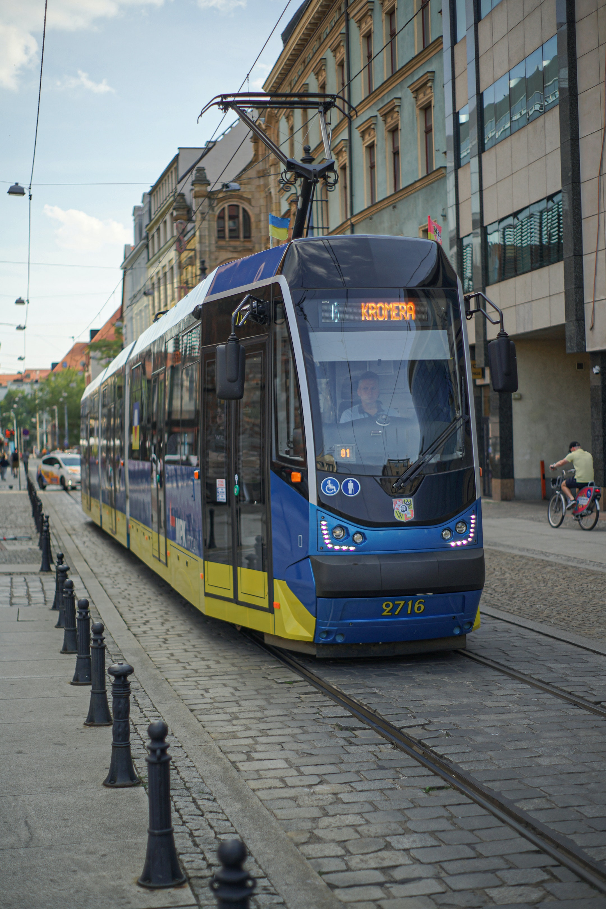
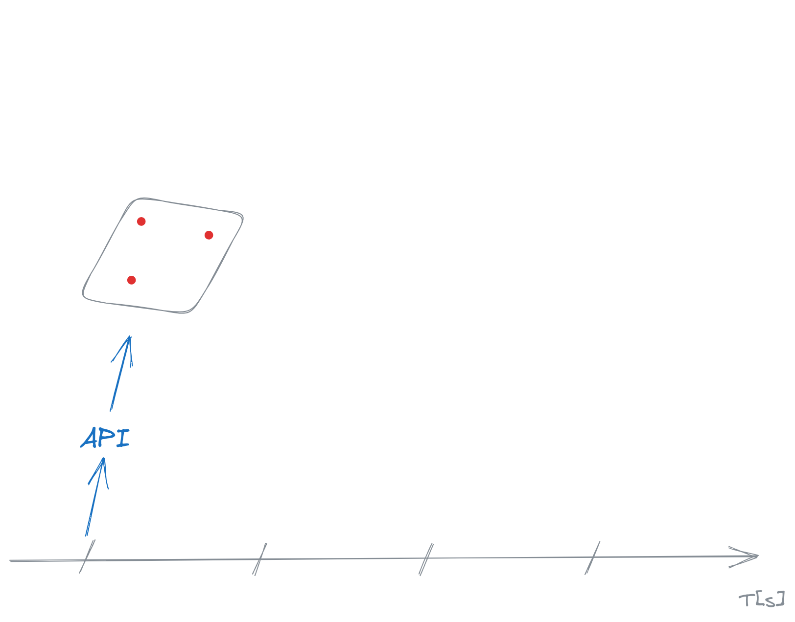

<!-- _class: intro -->
# How slow is your tram? :tram:

###### using STTP, CE3, FS2 and scala-cli



--- 

# About me :wave:

- https://michal.pawlik.dev 📄
- [@majkp@hostux.social](https://hostux.social/@majkp) 🔌

---

# I wanted to show how to enter the venue

---

# Good start


---

<!-- _class: divider -->

# So, trams in Wrocław

---

<!-- _class: divider -->

# They get creative


---

<!-- _class: divider yellow-background -->

# How bad can it be?

Let's find out

---

# Plan

1) Find data source of vehicle positions
2) Fetch and parse
3) Fetch some more
4) Calculate diffs
5) Produce statistics

---

# Find data

First shot: [Wrocław Open Data](https://www.wroclaw.pl/open-data/dataset/lokalizacjapojazdowkomunikacjimiejskiejnatrasie_data)

---

# Wroclaw Open Data

```bash
$ curl -s https://www.wroclaw.pl/open-data/datastore/dump/17308285-3977-42f7-81b7-fdd168c210a2 | head | column -t -s,
_id  Nr_Boczny  Nr_Rej  Brygada  Nazwa_Linii  Ostatnia_Pozycja_Szerokosc  Ostatnia_Pozycja_Dlugosc  Data_Aktualizacji
1    0          None                          51.1059417724609            17.0331401824951          2023-08-12 15:14:34.863000
2    1900       None    None     None         51.0670280456543            17.0984840393066          2023-08-11 12:07:08.877000
3    2206       None    01517                 51.1253318786621            17.0414428710938          2023-08-12 16:09:33.540000
4    2208       None    00309                 51.1245498657227            17.0415744781494          2023-08-12 16:08:45.613000
5    2212       None                          51.079460144043             17.0047359466553          2023-08-12 16:08:49.817000
```
###### Data fetched on 12.08.2023

---

# Some of it is pretty old 👴

```bash
$ curl -s https://www.wroclaw.pl/open-data/datastore/dump/17308285-3977-42f7-81b7-fdd168c210a2 | 
tail -n +2 | sort -t, -k 8,8 | head | column -t -s,      
34   2316  None                  51.1242408752441  17.0405292510986  2022-06-23 21:32:15.773000
557  8403  None     N10    N     51.1076545715332  17.0392875671387  2022-07-05 15:48:04.690000
324  4639  None                  51.0772018432617  17.0711059570312  2022-08-22 01:11:25.087000
292  4606  None     11308  112   51.0749778747559  17.0063076019287  2022-08-22 13:28:43.300000
379  5483  None     None   None  51.095060667      16.961589167      2022-09-20 23:35:26.007000
459  7400  None     10001        51.1481552124023  17.0230255126953  2022-09-25 04:40:37.697000
329  4807  None     None   None  51.1492080688477  17.0239391326904  2022-09-26 09:21:55.910000
398  7004  DW3987J               54.5531539916992  17.7985401153564  2022-10-03 15:53:05.910000
```

* Inconsistent
* Poor refresh rate
* Confusing old records

---

# Wrong way 🚧


---

<!-- _class: divider -->

# We need a better source

---

# Interactive map

https://mpk.wroc.pl/strefa-pasazera/zaplanuj-podroz/mapa-pozycji-pojazdow

---


<!-- ---

 -->

---


---

# Investigate 🕵️


---

# Investigate 🕵️

```bash
curl -s 'https://mpk.wroc.pl/bus_position' \
  -H 'accept: application/json, text/javascript, */*; q=0.01' \
  -H 'content-type: application/x-www-form-urlencoded; charset=UTF-8' \
  --data-raw 'busList%5Bbus%5D%5B%5D=110&busList%5Btram%5D%5B%5D=31&busList%5Btram%5D%5B%5D=33' \
  --compressed | jq       

[
  {
    "name": "31",
    "type": "tram",
    "y": 17.051546,
    "x": 51.076923,
    "k": 22471783
  },
  {
    "name": "31",
    "type": "tram",
    "y": 17.049835,
    "x": 51.081802,
    "k": 22472415
  },
 /* ... */
]  
```

---

# Finally data!


```json
[
  {
    "name": "31",
    "type": "tram",
    "y": 17.051546,
    "x": 51.076923,
    "k": 22471783
  },
 /* ... */
]    
```

---

# What does it mean? 🤔

* `name` - line name like `31`, `33`, `110`
* `type` - one of `tram`, `bus`
* `y` - latitude
* `x` - longitude
* `k` - most tricky one, looks like a vehicle id

---

<!-- _class: divider -->

# Plan

1. Find data source of vehicle positions ✅
2. Fetch and parse
3. Fetch some more
4. Calculate diffs
5. Produce statistics

---


<!-- _class: divider yellow-background -->


# Coding time 💻

---

# Fetch and parse

Shape of our request
* HTTP POST
* List of vehicles like `busList[bus][]=110&busList[tram][]=31&busList[tram][]=33`
* `content-type: application/x-www-form-urlencoded`
* Expect JSON output

---

<!-- _class: line-numbers -->

# STTP Client

Start with some imports

```scala
//> using dep "com.softwaremill.sttp.client3::fs2:3.8.16"
//> using dep "com.softwaremill.sttp.client3::circe:3.8.16"
//> using dep "com.softwaremill.sttp.client3::core:3.8.16"
//> using toolkit typelevel:latest

import cats.effect.*
import cats.implicits.given
import io.circe.Codec
import sttp.client3.*
import sttp.client3.circe.*
import sttp.client3.httpclient.fs2.HttpClientFs2Backend
import sttp.model.MediaType
```

---

<!-- _class: line-numbers -->

# STTP

```scala
val apiUri = uri"https://mpk.wroc.pl/bus_position"
val trams = List("31", "33")
val buses = List("110")

def payload(buses: List[String], trams: List[String]) =
  (trams.map(v => s"busList[tram][]=$v") ++
    buses.map(v => s"busList[bus][]=$v")).mkString("&")

// ☝️ builds this thing: busList[bus][]=110&busList[tram][]=31&busList[tram][]=33
```

---


# STTP

<!-- _class: line-numbers -->

```scala
val apiUri = uri"https://mpk.wroc.pl/bus_position"
val trams = List("31", "33")
val buses = List("110")

def payload(buses: List[String], trams: List[String]) =
  (trams.map(v => s"busList[tram][]=$v") ++
    buses.map(v => s"busList[bus][]=$v")).mkString("&")

def request(backend: SttpBackend[IO, Any]) = 
  basicRequest
    .post(apiUri)
    .body(payload(buses, trams)) // Something like busList[bus][]=110&busList[tram][]=31&busList[tram][]=33
    .contentType(MediaType.ApplicationXWwwFormUrlencoded)
    .response(asJson[List[Record]])
    .send(backend)
    .map(_.body)                 // We are only interested in the result
    .rethrow                     // Fail `IO` on all errors, we are being simple here
```

---

# STTP

<!-- _class: line-numbers -->

```scala
val apiUri = uri"https://mpk.wroc.pl/bus_position"
val trams = List("31", "33")
val buses = List("110")

def payload(buses: List[String], trams: List[String]) =
  (trams.map(v => s"busList[tram][]=$v") ++
    buses.map(v => s"busList[bus][]=$v")).mkString("&")

case class Record(
  name: String,
  x: Double,
  y: Double,
  k: Int
) derives Codec.AsObject      // This means the compiler will generate JSON Encoder and Decoder 

def request(backend: SttpBackend[IO, Any]): IO[List[Record]] = // Note the return type
  basicRequest
    .post(apiUri)
    .body(payload(buses, trams)) // Something like busList[bus][]=110&busList[tram][]=31&busList[tram][]=33
    .contentType(MediaType.ApplicationXWwwFormUrlencoded)
    .response(asJson[List[Record]])
    .send(backend)
    .map(_.body)                 // We are only interested in the result
    .rethrow                     // Fail `IO` on all errors, we are being simple here
```

---

# Let's run it

* Our `request` returns an `IO`, so we need a way to execute it
* It requires `SttpBackend` so we need to create one

---

# Let's run it

The easiest way to execute an `IO` is to create a `Main` class that handles it for us

```scala
object Main extends IOApp.Simple {
  def run: IO[Unit] = ??? // our logic goes here 
}
```

---

# Let's run it

<!-- _class: line-numbers -->

Let's create a backend, execute the request and print the result

```scala
object Main extends IOApp.Simple {
  def run = 
    HttpClientFs2Backend
      .resource[IO]()
      .use(backend => request(backend))
      .flatMap(IO.println)
}
```

---

# Let's run it

<!-- _class: line-numbers -->

```scala
object Main extends IOApp.Simple {
  def run = 
    HttpClientFs2Backend
      .resource[IO]()
      .use(backend => request(backend))
      .flatMap(IO.println)
}
```

Execution result

```bash
$ scala-cli sttp-client.scala

List(
  Record(31,51.141502,16.95872,22475890), Record(31,51.110912,17.02159,22475017), Record(31,51.07934,17.050734,22475050),
  Record(31,51.12252,17.011976,22475871), Record(31,51.097458,17.03275,22475942), Record(110,51.096992,17.037682,22312466),
  Record(33,51.112633,16.99349,22476133), Record(33,51.107376,17.035055,22476039), Record(33,51.11388,17.1032,22476064),
  Record(33,51.10771,17.040272,22476110)
)
```

---

# Nice, we've got the data!

We're back on track


---

<!-- _class: divider -->

# Plan

1. Find data source of vehicle positions ✅
2. Fetch and parse ✅
3. Fetch some more
4. Calculate diffs
5. Produce statistics

---

<!-- _class: divider yellow-background -->

# Refactoring time! 🚧

---

# Refactoring time! 🚧

The model is bound to what the API gives.

Let's decouple before we move on.

---

# Refactoring time! 🚧

Let's hide the API behind an interface

```scala
trait Vehicles[F[_]] {
  def list(): F[Seq[Vehicle]]
}
```

* Notice the `Vehicle` type - it needs better fields than `x`, `y`, `k`

---

<!-- _class: line-numbers -->

# `Vehicle` model

```scala
case class Vehicle(
  lineName: Vehicle.LineName,
  measuredAt: Instant,
  position: Position,
  id: Vehicle.Id
)
```

###### It could be called `VehiclePosition` or `VehicleMeasurement` but let's stick with `Vehicle` for clarity

---

<!-- _class: line-numbers -->

# `Vehicle` model

```scala
case class Vehicle(
  lineName: Vehicle.LineName,
  measuredAt: Instant,
  position: Position,
  id: Vehicle.Id
)

case class Position(latitude: Double, longitude: Double)

object Vehicle {
  case class Id(value: String) extends AnyVal
  case class LineName(value: String) extends AnyVal
}
```

---


# Refactoring time! 🚧

<!-- _class: line-numbers -->

Our existing code

```scala
val apiUri = uri"https://mpk.wroc.pl/bus_position"
val trams = List("31", "33")
val buses = List("110")

def payload(buses: List[String], trams: List[String]) = 
  (trams.map(v => s"busList[tram][]=$v") 
    ++ buses.map(v => s"busList[bus][]=$v")).mkString("&")

case class Record(
  name: String,
  x: Double,
  y: Double,
  k: Int
) derives Codec.AsObject      // This means the compiler will generate JSON Encoder and Decoder 

def request(backend: SttpBackend[IO, Any]): IO[List[Record]] = // Note the return type
  basicRequest
    .post(apiUri)
    .body(payload(buses, trams)) // Something like busList[bus][]=110&busList[tram][]=31&busList[tram][]=33
    .contentType(MediaType.ApplicationXWwwFormUrlencoded)
    .response(asJson[List[Record]])
    .send(backend)
    .map(_.body)                 // We are only interested in the result
    .rethrow                     // Fail `IO` on all errors, we are being simple here
```

---

# Refactoring time! 🚧

<!-- _class: line-numbers -->

Just wrap the `request` method

```scala
trait Vehicles[F[_]] {
  def list(): F[Seq[Vehicle]]
  // 👆 each time we call this, we receive latest data from API
}

object Vehicles {

  def mpkWrocInstance(
      backend: SttpBackend[IO, Any],
      buses: List[String],
      trams: List[String]
  ): Vehicles[IO] = ???
    // Same as `request` method

}
```

---

# `Vehicles` service

Now that we have a model, let's implement the service

```scala
trait Vehicles[F[_]] {
  def list(): F[Seq[Vehicle]]
}
```

---

<!-- _class: line-numbers -->

# `Vehicles` service

```scala
new Vehicles[IO] {
  def list(): IO[Seq[Vehicle]] = 
    for {
      now <- IO.realTimeInstant  // Get the time of measurement
      records <- request         // Same as few slides before
      results = records          // map each resulting row from MPK API
        .map { record =>         // and turn it into our `Vehicle` model
          Vehicle(
            lineName = Vehicle.LineName(record.name),
            measuredAt = now,
            position = Position(record.x, record.y),
            id = Vehicle.Id(record.k.toString)
          )
        }
    } yield results
}
```

---

# `Vehicles` service done ✅

```scala
trait Vehicles[F[_]] {
  def list(): F[Seq[Vehicle]]
}
```

Now we have an abstract way to fetch meaningful data
```scala
case class Vehicle(
  lineName: Vehicle.LineName,
  measuredAt: Instant,
  position: Position,
  id: Vehicle.Id
)
```


---

# One last thing

In the next step we'll be looking into the distance covered between two measurements

---

# Distance 

```scala
case class Vehicle(
  lineName: Vehicle.LineName,
  measuredAt: Instant,
  position: Position,
  id: Vehicle.Id
){
  // calculate distance in meters
  def distance(other: Vehicle): Double = ???
}
```

---

# Distance 

```scala
case class Vehicle(
  lineName: Vehicle.LineName,
  measuredAt: Instant,
  position: Position,
  id: Vehicle.Id
){
  // Don't worry about the details, it's a shameless copy-paste from StackOverflow 😅
  def distance(other: Vehicle): Double = {
    val earthRadius = 6371000 // Earth's radius in meters
    val lat1 = toRadians(position.latitude)
    val lon1 = toRadians(position.longitude)
    val lat2 = toRadians(other.position.latitude)
    val lon2 = toRadians(other.position.longitude)

    val dlon = lon2 - lon1
    val dlat = lat2 - lat1

    val a = pow(sin(dlat / 2), 2) + cos(lat1) * cos(lat2) * pow(sin(dlon / 2), 2)
    val c = 2 * atan2(sqrt(a), sqrt(1 - a))

    val distance = earthRadius * c

    distance
  }
}
```

---

# Distance

The point is, we can now calculate distance covered by vehicle

```scala
val measurement1: Vehicle = ???
val measurement2: Vehicle = ???

measurement1.distance(measurement2) // like this
```

###### It calculates [Geographical Distance](https://en.wikipedia.org/wiki/Euclidean_distance) but [Euclidean Distance](https://en.wikipedia.org/wiki/Euclidean_distance) would be good enough

---

# Back to the plan!

---

<!-- _class: divider -->

# Plan

1. Find data source of vehicle positions ✅
2. Fetch and parse ✅
3. Fetch some more 🛠️
4. Calculate diffs 🛠️
5. Produce statistics

---

# Streams 


---

# Who knows what a stream is? 🤚

---

# Recap from streaming

* Represent sequences of data elements
* Can be finite or infinite, synchronous or asynchronous
* Offer operations for transforming, filtering, and aggregating data


---

# FS2: Functional Streams for Scala

Short intro

---

# Let's have an exercise 🏃

* Create an infinite stream of natural numbers `1, 2, 3, 4, 5, ...`
* Keep only the odd ones `1, 3, 5, 7, ...`
* Slide through by 3 elements `(1, 3, 5), (3, 5, 7), (5, 7, 9), ...`
* Add each group `9, 15, 21, ...`
* Take first `10`


---

## How many lines of code would it take without streams?

Think of it for a second

<!-- 
Imperative solution

```scala
var counter = 1
var sumCounter = 0
var sum = 0

for (i <- 0 until 10) {
  for (j <- 0 until 3) {
    if (counter % 2 != 0) {
      sum += counter
    }
    counter += 1
  }
  println(s"Sum ${sumCounter + 1}: $sum")
  sum = 0
  sumCounter += 1
}
``` -->

---

# FS2: Functional Streams for Scala

Here's how you do this

---

# FS2: Functional Streams for Scala

<!-- _class: line-numbers -->


```scala
val stream: Stream[IO, Int] = 
  Stream
    .iterate(1)(_ + 1)  // Create an infinite stream of natural numbers
    .filter(_ % 2 != 0) // Filter for odd numbers: 1, 3, 5, 7, 9, ...
    .sliding(3)         // Slides over each 3 elements: (1, 3, 5), (3, 5, 7), (5, 7, 9), ...
    .map { chunk =>
      chunk(0) + chunk(1) + chunk(2) // Add them together: 9, 15, 21, ...
    }
    .take(10)           // Fetch the first ten results
```

---

# To the real use case!

---

# What should our app do

* Upon each `N` seconds call the API for new data
* Compare current result with previous one
  - Find how vehicle moved, calculate diff
* After a fixed amount of updates, show some statistics

---

# Let's visualize it!

---

<!-- _transition: none -->



---

<!-- _transition: none -->


---

<!-- _transition: none -->


---

<!-- _transition: none -->


---


---

# How to implement it

We want to build a stream that:

* Is infinite
* Acts on given time interval like every `N` seconds
* Lists vehicles using `Vehicles[IO].list()`
* Joins results by vehicle `id`
  - Because vehicles are not sorted and some might go missing
* Calculate the distance using `Vehicle.distance` and the elapsed time
* Build a map of `(Vehicle.LineName, Vehicle.Id) -> (Distance, AVG Speed)`


---

# Step by step

Infinite stream that lists vehicles every `N` seconds

---

<!-- _class: line-numbers -->

# Step by step

Infinite stream that lists vehicles every `N` seconds

```scala
val interval = 7.seconds // 7 is a fine value for `N`

def stats(vehicles: Vehicles[IO]): IO[Map[(LineName, Id), VehicleStats]] = 
  fs2.Stream
    .fixedRateStartImmediately[IO](interval)
    .evalMap(_ => vehicles.list())
    // TBC
```

Easy right?

---

# Step by step

- Is infinite ✅
- Acts on given time interval like every `N` seconds ✅
- When the time comes - it lists vehicles using `Vehicles[IO].list()` ✅
- Joins previous and current result by vehicle `id`
  - Because vehicles are not sorted and some might go missing
- Calculate the distance using `Vehicle.distance` and the elapsed time
- Build a map of `(Vehicle.LineName, Vehicle.Id) -> VehicleStats`
  - Where `VehicleStats` are distance, time and avg speed

---

<style scoped>
/* Center the image */
p {
  text-align: center;
}
</style>

# Step by step


Slide over data, take current and previous measurement and calculate the diff

---

# Step by step

Slide over data, take current and previous measurement and calculate the diff

<!-- _class: line-numbers -->

```scala
def stats(vehicles: Vehicles[IO]): IO[Map[(LineName, Id), VehicleStats]] = 
  fs2.Stream
    .fixedRateStartImmediately[IO](interval)
    .evalMap(_ => vehicles.list())
    .sliding(2)
    .map(chunk => calculateDiff(chunk(0), chunk(1))) // That needs explaining
    // TBC
```

---

# Step by step

<!-- _class: line-numbers -->

Important part
```scala
def calculateDiff(snapshot1: Seq[Vehicle], snapshot2: Seq[Vehicle]): Seq[VehiclePositionDiff] =
  snapshot1
    .join(snapshot2)
    .map(
      (v1, v2) => 
        VehiclePositionDiff(v1.lineName, v1.id, secondDuration(v1.measuredAt, v2.measuredAt), v1.distance(v2))
    )

case class VehiclePositionDiff(line: Vehicle.LineName, id: Vehicle.Id, secondsDuration: Double, metersDistance: Double)
```

---

# Step by step

<!-- _class: line-numbers -->

Important part
```scala
def calculateDiff(snapshot1: Seq[Vehicle], snapshot2: Seq[Vehicle]): Seq[VehiclePositionDiff] =
  snapshot1
    .join(snapshot2)
    .map(
      (v1, v2) => 
        VehiclePositionDiff(v1.lineName, v1.id, secondDuration(v1.measuredAt, v2.measuredAt), v1.distance(v2))
    )

case class VehiclePositionDiff(line: Vehicle.LineName, id: Vehicle.Id, secondsDuration: Double, metersDistance: Double)
```

Boring stuff
```scala
extension (snapshot: Seq[Vehicle]) {
  def join(snapshot2: Seq[Vehicle]): Seq[(Vehicle, Vehicle)] = 
    snapshot.flatMap{ v1 => snapshot2.collect { case v2 if v2.id == v1.id => (v1, v2)} }
}

def secondDuration(start: Instant, end: Instant) = 
  (end.toEpochMilli() - start.toEpochMilli()).toDouble / 1000
```

---

# Step by step

Where are we again?

<!-- _class: line-numbers -->

```scala
def stats(vehicles: Vehicles[IO]): IO[Map[(LineName, Id), VehicleStats]] = 
  fs2.Stream
    .fixedRateStartImmediately[IO](interval)
    .evalMap(_ => vehicles.list())
    .sliding(2)
    .map(chunk => calculateDiff(chunk(0), chunk(1))) // basically calculate derivative
    // TBC
```

Our stream lists vehicles every `interval` and calculates a list of diffs

---

# Step by step

- Is infinite ✅
- Acts on given time interval like every `N` seconds ✅
- When the time comes - it lists vehicles using `Vehicles[IO].list()` ✅
- Joins previous and current result by vehicle `id` ✅
- Calculate the distance using `Vehicle.distance` and the elapsed time ✅
- Build a map of `(Vehicle.LineName, Vehicle.Id) -> VehicleStats`
  - Where `VehicleStats` are distance, time and avg speed

---

# Step by step

Let's calculate the stats

---

<!-- _class: line-numbers -->

# Easy!

```scala
def stats(vehicles: Vehicles[IO]): IO[Map[(LineName, Id), VehicleStats]] = 
  fs2.Stream
    .fixedRateStartImmediately[IO](interval)
    .evalMap(_ => vehicles.list())
    .sliding(2)
    .map(chunk => calculateDiff(chunk(0), chunk(1)))
    .take(numberOfSamples)
    .fold(Map.empty)(summarize) // 👈 `summarize` needs explaining
    .compile
    .toList
    .map(_.head)
```

---

<!-- _class: line-numbers -->

# Summarize each step

The `summarize` describes incremental step of building the summary

```scala
def summarize(
  previousSummary: Map[(Vehicle.LineName, Vehicle.Id), VehicleStats],
  nextDiff: Seq[VehiclePositionDiff]
): Map[(LineName, Id), VehicleStats] = {
  val currentSummary =
    nextDiff
      .groupMapReduce
        (d => (d.line, d.id)) // group by line and id
        (diff => VehicleStats(diff.metersDistance, diff.secondsDuration)) // map to VehicleStats
        ((a, b) => a)         // in case there were multiple results, takes first
  Monoid.combine(previousSummary, currentSummary) // Magic 🌠
}
```

---

<!-- _class: line-numbers -->

# Final stream

```scala
def stats(vehicles: Vehicles[IO]): IO[Map[(LineName, Id), VehicleStats]] = 
  fs2.Stream
    .fixedRateStartImmediately[IO](interval)
    .evalMap(_ => vehicles.list())
    .sliding(2)
    .map(chunk => calculateDiff(chunk(0), chunk(1)))
    .take(numberOfSamples)
    .fold(Map.empty)(summarize)
    .compile
    .toList
    .map(_.head)
```

--- 

# Let's run it!

<!-- _class: line-numbers -->

```scala
object Main extends IOApp.Simple {
  def run = 
    HttpClientFs2Backend
      .resource[IO]()
      .use(backend => program(backend) *> IO.println("Program finished"))

  private val trams = List("8", "16", "18", "20", "21", "22")
  private val buses = List("124", "145", "149")

  def program(backend: SttpBackend[IO, Any]) = for {
    client = MpkWrocApiClient.instance(backend)(buses, trams)
    vehicles = Vehicles.mpkApiAdapter(client)
    stats <- StatsCalculator.stats(vehicles)
    _ <- IO.println(stats.mkString("\n"))
    aggregate = StatsCalculator.aggregateLines(stats)
    _ <- IO.println(aggregate.mkString("\n"))
    fastest = aggregate.maxBy((line, stats) => stats.avgSpeedKMH)
    slowest = aggregate.minBy((line, stats) => stats.avgSpeedKMH)
    avg = aggregate.values.map(_.avgSpeedKMH).reduce((a, b) => (a + b) / 2)
    _ <- IO.println(s"Fastest: $fastest")
    _ <- IO.println(s"Slowest: $slowest")
    _ <- IO.println(s"Average: $avg")
  } yield ()

}
```

---

# Results

Captured at 05.09.2023 08:55

Parameters
```scala
val interval = 9.seconds
val numberOfSamples = 72
```

---

# Results

Raw results

```scala
$ scala-cli main.scala
Compiling project (Scala 3.3.0, JVM)
Compiled project (Scala 3.3.0, JVM)
(LineName(22),Id(22695460)) -> VehicleStats(distance = 3919 m, duration = 648 s, avgSpeed = 21.77255912367109 km/h)
(LineName(145),Id(22586856)) -> VehicleStats(distance = 739 m, duration = 126 s, avgSpeed = 21.122011131387406 km/h) 
(LineName(145),Id(22586857)) -> VehicleStats(distance = 2234 m, duration = 495 s, avgSpeed = 16.248122084766138 km/h)
(LineName(21),Id(22696333)) -> VehicleStats(distance = 3193 m, duration = 648 s, avgSpeed = 17.73752484183318 km/h)
(LineName(18),Id(22696041)) -> VehicleStats(distance = 1540 m, duration = 648 s, avgSpeed = 8.555832904315897 km/h) 
(LineName(22),Id(22695482)) -> VehicleStats(distance = 0 m, duration = 18 s, avgSpeed = 0.0 km/h)                    
(LineName(8),Id(22696541)) -> VehicleStats(distance = 2184 m, duration = 648 s, avgSpeed = 12.132485872335115 km/h) 
(LineName(16),Id(22696499)) -> VehicleStats(distance = 47 m, duration = 207 s, avgSpeed = 0.817474989663128 km/h)  
(LineName(8),Id(22695483)) -> VehicleStats(distance = 450 m, duration = 351 s, avgSpeed = 4.610678940634453 km/h)   
(LineName(16),Id(22696372)) -> VehicleStats(distance = 296 m, duration = 594 s, avgSpeed = 1.792706196897714 km/h)   
(LineName(21),Id(22696103)) -> VehicleStats(distance = 2418 m, duration = 648 s, avgSpeed = 13.434871805600434 km/h)
(LineName(18),Id(22695928)) -> VehicleStats(distance = 2273 m, duration = 648 s, avgSpeed = 12.626370686549246 km/h)
(LineName(21),Id(22696071)) -> VehicleStats(distance = 2376 m, duration = 648 s, avgSpeed = 13.198798955281166 km/h)
(LineName(18),Id(22696086)) -> VehicleStats(distance = 3825 m, duration = 648 s, avgSpeed = 21.24999578241602 km/h)  
(LineName(8),Id(22696520)) -> VehicleStats(distance = 621 m, duration = 648 s, avgSpeed = 3.4475768495404635 km/h) 
(LineName(18),Id(22696347)) -> VehicleStats(distance = 2632 m, duration = 648 s, avgSpeed = 14.622727466844548 km/h)
(LineName(18),Id(22695908)) -> VehicleStats(distance = 1414 m, duration = 315 s, avgSpeed = 16.16467742050453 km/h)
(LineName(145),Id(22586746)) -> VehicleStats(distance = 2300 m, duration = 387 s, avgSpeed = 21.39539415200732 km/h)
(LineName(21),Id(22696022)) -> VehicleStats(distance = 1780 m, duration = 648 s, avgSpeed = 9.889907036709332 km/h)
(LineName(18),Id(22695842)) -> VehicleStats(distance = 2863 m, duration = 648 s, avgSpeed = 15.90794010400161 km/h)
(LineName(145),Id(22586800)) -> VehicleStats(distance = 3468 m, duration = 648 s, avgSpeed = 19.2690822332545 km/h)
(LineName(21),Id(22696003)) -> VehicleStats(distance = 1611 m, duration = 648 s, avgSpeed = 8.948502029544693 km/h)
(LineName(8),Id(22696500)) -> VehicleStats(distance = 0 m, duration = 45 s, avgSpeed = 0.0 km/h)       
(LineName(8),Id(22696371)) -> VehicleStats(distance = 145 m, duration = 27 s, avgSpeed = 19.30136010668995 km/h)
(LineName(18),Id(22695857)) -> VehicleStats(distance = 0 m, duration = 207 s, avgSpeed = 0.0 km/h)             
(LineName(8),Id(22699335)) -> VehicleStats(distance = 1330 m, duration = 648 s, avgSpeed = 7.387016996416382 km/h)
(LineName(18),Id(22696057)) -> VehicleStats(distance = 770 m, duration = 423 s, avgSpeed = 6.554339292764373 km/h)
(LineName(16),Id(22697696)) -> VehicleStats(distance = 2419 m, duration = 648 s, avgSpeed = 13.439411970086935 km/h)
(LineName(124),Id(22675475)) -> VehicleStats(distance = 1314 m, duration = 648 s, avgSpeed = 7.302029977487313 km/h)
(LineName(21),Id(22695984)) -> VehicleStats(distance = 2304 m, duration = 648 s, avgSpeed = 12.801481111234681 km/h)
// ...
```
---

# Results

Aggregate

```scala
LineName(22) -> VehicleStats(distance = 19127 m, duration = 4572 s, avgSpeed = 15.060665307794535 km/h)
LineName(16) -> VehicleStats(distance = 16360 m, duration = 5049 s, avgSpeed = 11.664853832122114 km/h)
LineName(21) -> VehicleStats(distance = 20526 m, duration = 5319 s, avgSpeed = 13.892783846488033 km/h)
LineName(145) -> VehicleStats(distance = 17318 m, duration = 3600 s, avgSpeed = 17.31835235672147 km/h)
LineName(149) -> VehicleStats(distance = 815 m, duration = 459 s, avgSpeed = 6.395473232361093 km/h)
LineName(18) -> VehicleStats(distance = 22863 m, duration = 6507 s, avgSpeed = 12.64896296592901 km/h)
LineName(124) -> VehicleStats(distance = 15596 m, duration = 3600 s, avgSpeed = 15.59662045634935 km/h)
LineName(8) -> VehicleStats(distance = 8850 m, duration = 3663 s, avgSpeed = 8.697846722967476 km/h)
```


---

# Stats 📉

* Buses 🚌
  * Fastest: **17.3** km/h - line `145`
  * Slowest: **6.4** km/h - line `149`
* Trams 🚊
  * Fastest: **15.1** km/h - line `22`
  * Slowest: **8.7** km/h - line `8`
* Average: **11.2** km/h


---

# Therefore...

---

<!-- _class: divider yellow-background -->

# How slow is your tram? :tram:

---

<!-- _class: divider yellow-background -->

#### How slow is your tram? :tram:

# Too slow!

---

# But we have learned something! 📖

* Data is not easy to find
* Streams are not that hard
* Smartly applied `Monoid` can save you some code
* Bike can save you some time

---

# Kraków specific links

- https://github.com/tomekzaw/ttss
- https://gtfs.ztp.krakow.pl/robi
- http://www.ttss.krakow.pl/internetservice/
- http://ttss.mpk.krakow.pl/internetservice/
- http://kokon.mpk.krakow.pl/

---

# Thank you!

<style scoped>
/* Styling for centering (required in default theme) */
h1, h2, h3, h4, h5, p, ul, li {
  text-align: center;
}
</style>

Keep in touch! 🤝

Blog: [blog.michal.pawlik.dev](https://blog.michal.pawlik.dev)
Linkedin: [Michał Pawlik](https://www.linkedin.com/in/michał-pawlik/)
Github: [majk-p](https://github.com/majk-p)
Mastodon: [@majkp@hostux.social](https://hostux.social/@majkp)

---

# Bonus!

---

# Bonus: Monoid magic

Thanks to how monoids compose, you can combine two maps for free
```scala
//> using toolkit typelevel:latest

import cats.Monoid

val a = Map[String, Int]("foo" -> 1, "bar" -> 5)
val b = Map[String, Int]("bar" -> 3, "baz" -> 0)

println(
    Monoid.combine(a, b)
)
```

---

# Bonus: Monoid magic

Thanks to how monoids compose, you can combine two maps for free
```scala
//> using toolkit typelevel:latest

import cats.Monoid

val a = Map[String, Int]("foo" -> 1, "bar" -> 5)
val b = Map[String, Int]("bar" -> 3, "baz" -> 0)

println(
    Monoid.combine(a, b)
)
```

The result is
```sh
$ scala-cli monoid.sc 
Compiling project (Scala 3.3.0, JVM)
Compiled project (Scala 3.3.0, JVM)
Map(bar -> 8, baz -> 0, foo -> 1)
```

---

# Bonus: Monoid magic

So when we provide a `Monoid` for `VehicleStats` like this

```scala
given Monoid[VehicleStats] with {

  override def combine(x: VehicleStats, y: VehicleStats): VehicleStats = 
    VehicleStats(
      x.metersDistance + y.metersDistance,
      x.secondsDuration + y.secondsDuration
    )

  override def empty: VehicleStats = VehicleStats(0,0)
}
```

This works for free
```scala
Monoid.combine(previousSummary, currentDiffSummary) // combine previous stats with current one together
```
